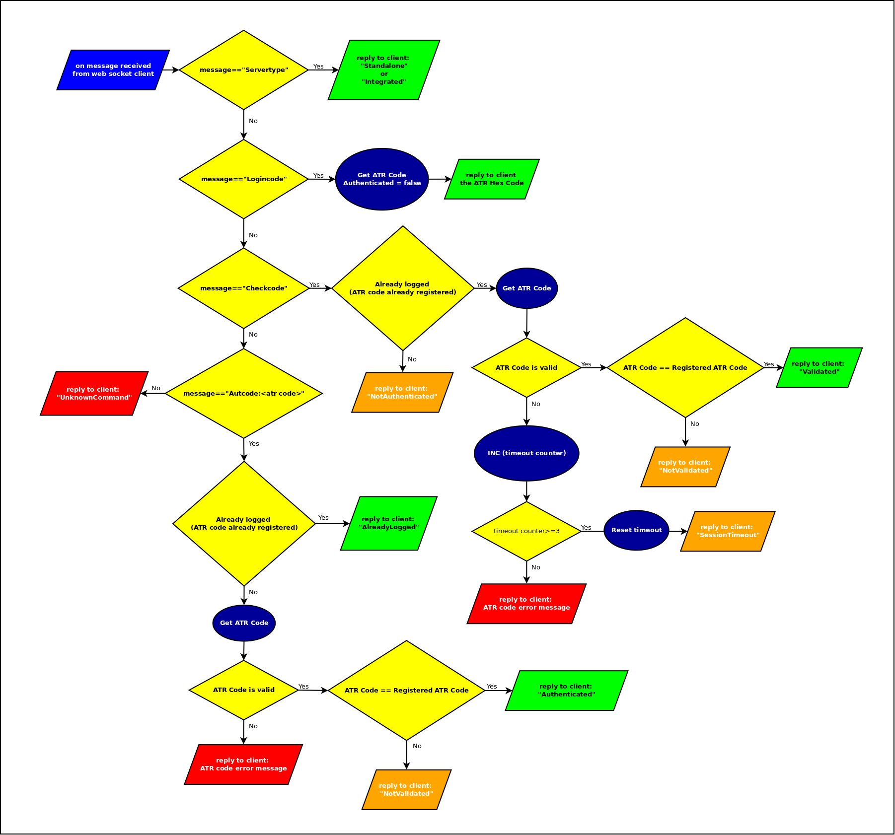

# SCD_SMCAuthServer
Smart Card Authentication Server

## Description

The authentication server can be work in two modality:

- <b>standalone</b>
- <b>embedded</b> on your application

Can be used with a web browser if , on login, an additional level of security is required, or as security key for your own application. Also, this server can be used embedding it on your own application.

## How to work

When started, the server open the port 10552, and wait for web socket connection.

You can connect to server by the onenction string: <b>"ws://localhost:10522"</b>.

This version of server supports only the unsecure conenction.

The server accept commands for:

- smart card ATR code reading
- management of authentication, 
- login consistency check
- card detection

Il server inoltre restituisce delle stringhe di errore nel caso in cui la carta non è inserita nel lettore, o se nessun lettore Smart Card viene rilevato dal server.

### Comandi Server:

- <b>Logincode:</b>  

  richiede il codice <b>ATR</b> al server: il server risponde inviando il codice <b>ATR</b>.
  Dopo l'invio  di questo comando, i controlli di validazione falliranno: bisogna rieseguire il login, l'autenticazione e la   validazione. Vedi comando successivo.

- <b>Authcode:ATR </b> => invia al server il codice ATR utilizzato per il login, se corrisponde al codice ATR della Smart Card inserita il login viene accettato, ed il codice ATR viene accettato e validato. Il server considererà valido il codice ATR validato in sede di autenticazione.

  Return reply:

    - error string: se la smart card non è inserita o il lettore non viene trovato,

    - <b>Validated</b>:     => in caso di controllo di validazione positivo

    - <b>Notvalidated</b>:  => Il codice ATR della Smart Card inserita non corrisponde al codice ATR validato

    - <b>AlreadyLogged</b>: => Autenticazione già eseguita precedentemente
.........................................................................................................................................................................................................

- <b>Checkcode:</b>=> verifica la presenza della Smart Card ed esegue il controllo di validazione.

Restituisce:

un errore se la smart card non è inserita o il lettore non viene trovato,

Validated  => in caso di controllo con esito positivo

Notvalidated => Il codice ATR della Smart Card inserita non corrisponde al codice ATR validato

NotAuthenticated => il controllo di validazione può essere eseguito solo dopo l'autenticazione e la validazione del codice ATR. Se l'applicazione WEB, nonostante sia correttamente autenticata, riceve questa risposta deve subito tornare alla pagina di login perchè potrebbe esserci un tentativo di forzare il server. Il controllo di validazione infatti si deve esegure solo dopo la validazione del codice ATR, cioè solo dopo che laì'applicaqzione si è correttamente autenticata. infatti non ha senso eseguire il controllo di validazione se l'applicazione non ha eseguito il login.
..........................................................................................................................................................................................................

- <b>Servertype:</b>restituisce "Integrated", "Standalone"

## Flow Diagram

## Come comunicare col server per eseguire la procedura di autenticazione validazione e controllo</u>

Si premette che la pagina web di login deve oltre i parametri quali username, password etc. deve contenere un ulteriore campo hidden che conterrà il codice ATR letto dalla Smart Card inserita nel lettore.

La pagina web di login invia al server smart card tramite uno script javascript il comando <b>"Logincode:"</b> , ed ottiene il codice ATR da impostare nel campo hidden.
Il codice ATR viene inviato al server WEB per l'autenticazione. Se l'utente viene autenticato (il codice ATR corrisponde (match) con gli altri parametri di login, il codice viene reinviato indietro dal server web all'interno della pagina web (dentro una variabile javascript o un campo hidden, o come attributo di un tag etc.) che viene caricata se il login ha  avuto esito positivo,
Al termine del caricamento della pagina web un script javascritp invia il comando <b>"Authcode:<ATR>"</b> al server di gestione della smartcard per la validazione: es. <b>"Authcode:3bff1800008131fe45006b05051017012101434e531031805e"</b> se il codice non è validato bisogna tornare alla pagina di login
Ad intervalli temporizzati, bisogna eseguire il controllo di validazione inviando il comando <b>"Checkcode:"</b> in caso di fallimento tornare al login, nel caso in cui per più di n-secondi non viene rilevata la smartcard od il lettore si torna al login.
Il controllo temporizzato non è necessario se si utilizza il browser proprietario, poichè se ne occupa il browser stesso.

Inoltre con il browser proprietario non è necessario controllare il valori restituiti da comando Authcode, poichè il browser stesso decide se disconnettersi o meno.
