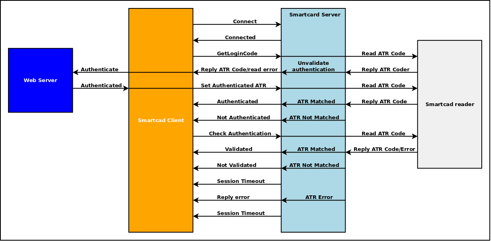

# SCD-SMCAuthServer
Smart Card Authentication Server (Qt/C++)

## Description

The SCD Smart Card Authentication Server allow you to read ATR code from your Smart Card and use it for login to remote web server or to acces to your own application. 
You can Ask to Server to read ATR Code from smart Card and manage the authentication, to check the matching of current ATR code with the authenticated code, or to check if the smart card is inserted into you card reader.

The authentication server can be work in two modality:

- <b>standalone</b>
- <b>embedded</b> on your application

Can be used with a web browser if , on login, an additional level of security is required, or as security key for your own application. Also, this server can be used embedding it on your own application.

## How it works

When started, the server open the port 10552, and wait for web socket connection.
Web socket client can connects to the server by the connection string: <b>"ws://localhost:10522"</b>.

This version of server supports only the unsecure connection.

The server accepts commands for:

- smart card ATR code reading
- management of authentication, 
- login consistency check
- card detection

Also, the sever reply with an error string in case of the smart card is not detected  (is not inserted into reeader), or no readers is detected.

### Server Commands:

- <b>Logincode:</b>  

  Require the <b>ATR</b> code: the server reply sending the <b>ATR</b> code readed from smart card.
  After sending this command, the validation controls will fails: you will need to log in again, authenticate and validate.
  See next command.
  This command anyway invalidate current session, and the message 'SessionExpired' will be anyway sent to client, also on       error.  
  
- <b>AtrCode</b>  

  Require the <b>ATR</b> code. This command do not invalidate current session. 
  
  Return reply:

    - <b>error string</b>  : the smart card is not detected  (is not inserted into reeader), or no readers is detected.

    - <b>Atr:value</b>     : value is the value of ATR code
  
- <b>Authcode:ATR </b>

  Send to server the <b>ATR</b> code you have using for login, if match the <br>ATR</b> code of smart card currently inserted   into reader, the login authentication code is validated: the server store this code for next validation checking.
  
  Return reply:

    - <b>error string</b>  : the smart card is not detected  (is not inserted into reeader), or no readers is detected.

    - <b>Authenticated</b>     : validation success

    - <b>NotAuthenticated</b>  : the smart card <b>ATR</b> code do not match the <b>ATR</b> code validated

    - <b>AlreadyLogged</b> : not to need to autheticate: already logged in

- <b>Checkcode:</b>

  Detect smart card (if is it inserted into reader) and perform the validation check

  Return reply:

    - <b>error string</b>     : the smart card is not detected  (is not inserted into reeader), or no readers is detected.

    - <b>Validated</b>        : authentication valid

    - <b>Notvalidated</b>     : the smart card <b>ATR</b> code do not match the <b>ATR</b> code validated, you should to                                     logout.

    - <b>NotAuthenticated</b> : currently not authenticated: you should to log in.
    
    - <b>SessionExpired</b>   : you should to logout.
    
  The validation check should be performad only after the authentication and validation of<b>ATR</b>code. It makes no sense     to check the validations if you are not logged in.
  If not validated or authenticated is safely and strictly  recomended to logout from your application andif need,  again log   in. If thea are an error you con wait until <b>SessionExpired</b> is issued. 

- <b>Servertype:</b> 

  Return reply:
  
    - <b>Integrated</b>
    - <b>Standalone</b>
    
- <b>PollTimeout:timeout</b> 

  Set the server polling timeout, timeout is a numeric string value expressed in seconds. 
  If Server receive the command <b>LoginCode</b> or <b>CheckCode</b>, it starts a polling for the smartcard check.
  Every timeout seconds the server check the smartcard. If the status of reader or the smartcard is differet from last         checking, the server issues a new message to client. To stop the server polling set timeout to 0. 
  If timeout is set to zero, the server reply one time if riceve the command <b>LoginCode</b> or <b>CheckCode</b>. 
  The other commands, in general, do not stop the polling: the server reply to immediate command, e return to previous         polling status.
   
  Return reply:
  
    - <b>Timeout:seconds</b>
    
## Diagram Flow


## How to test the server

Download the project typing on your linux terminal

```
$ git clone https://github.com/sc-develop/scd_smcauthserver
```
Before compile the server project, you must install on your linux system the PC/SC library.

```
$ sudo apt-get install libpcsclite1, libpcsclite1-dev
```

Run Qt Creator, load the project file build and run the server.

To test the Smart Card Autentication Server you can load the <b>atr.html</b> page on your browser. 
Connect your smartcard  reader to the USB connector of your PC/Laptop  and insert the smartcard into the reader. 
Now you can test the server by clicking the buttons on atr.html web page.
You can change the server port value editing the config.cfg file created automatically when the serve starts first time.
```
~/scd_smcauthserver/bin$ sudo nano config.cfg
```
```
[general]
port=10522
```
Save the config.cfg file and the restart the server.

## How to use the server for authentication and validation checking

The typical use is authentication on a remote server such as, for example, a WEB portal.
First you need to read the ATR code to associate with your user.
You can get the <b>ATR</b> code by using the <b>atr.html</b> page how explained above 
Now you can associate the <b>ATR</b> code with the username and password of your user in the authentication table of the users of your database server

```
 username : admin
 password : admin
 atr      : 3aff1800009131ff56006b05041017012101324e531031915f
 ```

The explanation of authentication on remote server by web page is beyond the scope of this document.

Now you are ready to use the SCD Smart Card Authentication Server full services.

The typical authentication session is shown on the diagram below.

The login web page should contain the <b>ATR</b> hidden field. This field will be automatic filled with the <b>ATR</b> code readed from smartcard.

1) The login web page ask to the server the ATR code by sending the command <b>"Logincode:"</b>, and set the ATR hidden field    with the readed ATR code.

2) When the user submits the login,  the <b>ATR</b> code is sent to web server togheter  username and passwor for the            authentication. 

3) If the authentication succeeded (the ATR code match username and password) the command <b>Authcode:<ATR></b> will be sent    to the smart card server to validate the ATR code.
   if your ATR code is <b>3aff1800009131ff56006b05041017012101324e531031915f</b> the command sent to the server will be          <b>"Authcode:3aff1800009131ff56006b05041017012101324e531031915f"</b>. 
   If the validation fails you should to return to login page.
  
4) At timed intervals, or when needed, you may be check validation by sending to the server the command <b>"Checkcode:"</b> If validation fails, or if session expired you should login again.

## Diagram of typical authentication session


